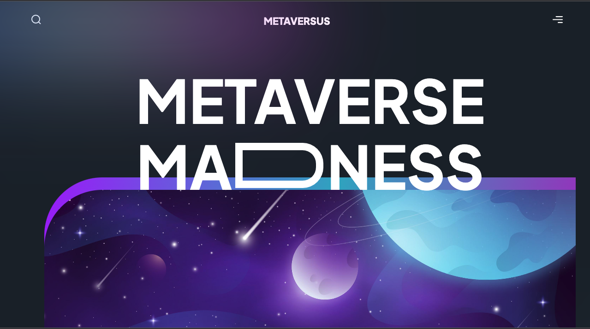
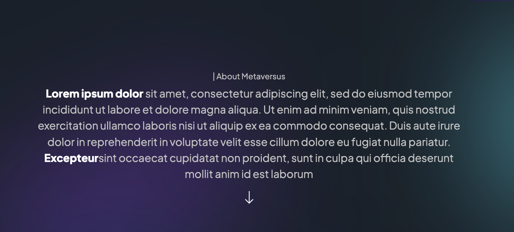

## Metaversus

Front end exercise by creating a landing page with sufficient transition and animation. Using Nextjs13, tailwindcss and framer motion.

![Half Section][def]

[def]: public/record.mp4